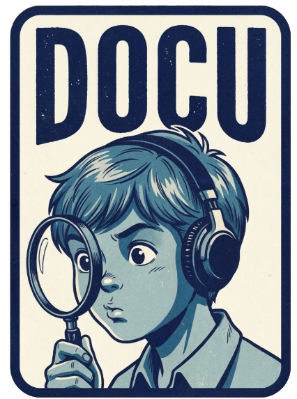

<p align="center">
  
</p>

# Documetro

Documetro is a document intelligence workspace. It ingests mixed document batches, builds a hybrid retrieval index, and can answer questions through a split-provider RAG pipeline: OpenRouter handles embeddings, multimodal extraction, and lightweight answer drafting, while Nous Hermes handles query understanding and evidence finding.

## What it does

- Parses `pdf`, `doc`, `docx`, `xls`, `xlsx`, `pptx`, `csv`, `tsv`, `txt`, `json`, `html`, `xml`, and common text files.
- Uses OpenRouter embeddings for semantic retrieval when `OPENROUTER_API_KEY` is configured.
- Chooses the embedding space intelligently:
  - text-only corpora use the cheaper text embedding model
  - corpora containing images switch to a unified multimodal embedding model so image and text chunks live in one vector space
  - audio and video are converted to retrieval-ready text first, then embedded in the active corpus space
- Uses OpenRouter multimodal processing for images, audio, and video files, converting them into retrieval-ready text before indexing.
- Uses `liquid/lfm2-8b-a1b` through OpenRouter for lightweight answer synthesis when remote generation is enabled.
- Uses Nous `Hermes-4-70B` for query planning and retrieval reranking when `NOUS_API_KEY` is configured.
- Surfaces cross-document topics and similarity signals in a chat-oriented interface.
- Keeps uploads, indexes, and runtime artifacts temporary. The app cleans them on reset, shutdown, and next start.

## Model Harmony Configuration

Documetro uses a retrieval stack where embeddings lead, and classical ML signals support retrieval quality:

| Layer | Weight | Description |
|-------|--------|-------------|
| **Lexical (TF-IDF)** | 18% | Exact term matching for anchors, names, and literal phrases |
| **Latent (LSI/LSA)** | 10% | Low-cost semantic backstop across chunk vocabulary structure |
| **Embedding (OpenRouter)** | 62% | Primary dense retrieval layer, text-only or multimodal-unified depending on corpus |
| **Reasoning (Nous Hermes)** | N/A | Query planning and evidence reranking before answer generation |

Default embedding models:

- Text-first corpora: `nvidia/llama-3.2-nv-embedqa-1b-v2:free`
- Corpora with images: `nvidia/llama-nemotron-embed-vl-1b-v2:free`

This keeps one coherent embedding space per corpus instead of mixing incompatible vectors.

### Supported Question Types

The system automatically detects question types and adapts retrieval:

- **Summary**: "what is it about", "summarize", "overview"
- **Entity Analysis**: "what company", "companies", "organization"
- **Language Analysis**: "multilingual", "language", "languages"
- **Numerical Analysis**: "numbers", "csv", "data", "statistics"
- **How-to**: "how do i", "how can i", "how to"
- **Comparison**: "compare", "difference", "versus"
- **List**: "list", "what are", "which"

### Evidence Formatting

Evidence passed to the LLM includes:
- Document name and section title
- Locator (page/section reference)
- Extended excerpt (320 chars with context)
- Relevance score

This ensures the LLM has sufficient context for accurate answers.

## Architecture

- `documetro/extractors.py`: local extraction pipeline, transcript cleanup, and OpenRouter multimodal preprocessing for images, audio, and video.
- `documetro/openrouter.py`: OpenRouter client for text and multimodal embeddings, multimodal file analysis, and lightweight answer generation.
- `documetro/nous.py`: Nous Hermes client for retrieval planning and evidence reranking.
- `documetro/engine.py`: chunking, hybrid retrieval, clustering, semantic scoring, and evidence-grounded QA.
- `documetro/service.py`: runtime workspace, upload queue, background indexing, status tracking, and cleanup behavior.
- `documetro/app.py`: FastAPI application serving both API and web UI.
- `documetro/static/`: responsive LLM-style frontend built with plain HTML, CSS, and JavaScript.
- `run.sh`: launcher that finds an open port, stops prior instances, checks dependencies, and starts the app.

## Run

```bash
./run.sh
```

OpenRouter configuration lives in the project-local `.env` file:

```bash
OPENROUTER_API_KEY=your_key_here
OPENROUTER_EMBEDDING_MODEL=nvidia/llama-3.2-nv-embedqa-1b-v2:free
OPENROUTER_MULTIMODAL_EMBEDDING_MODEL=nvidia/llama-nemotron-embed-vl-1b-v2:free
OPENROUTER_GENERATION_MODEL=liquid/lfm2-8b-a1b
NOUS_API_KEY=your_nous_key_here
NOUS_REASONING_MODEL=Hermes-4-70B
```

Optional overrides:

```bash
OPENROUTER_MULTIMODAL_MODEL=openai/gpt-4o-mini
NOUS_BASE_URL=https://inference-api.nousresearch.com/v1
```

Optional commands:

```bash
./run.sh status
./run.sh stop
./run.sh restart
```

## Verify

```bash
python3 -m unittest discover -s tests -v
```
